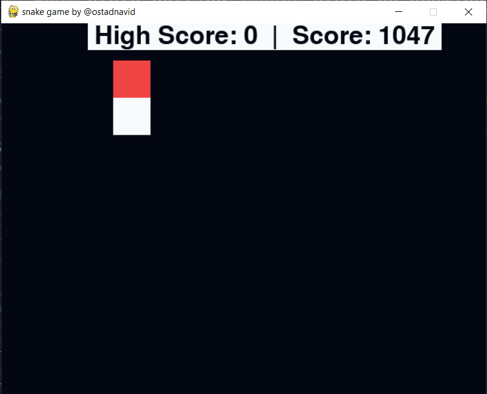
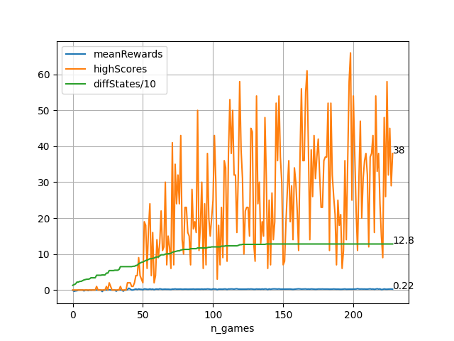
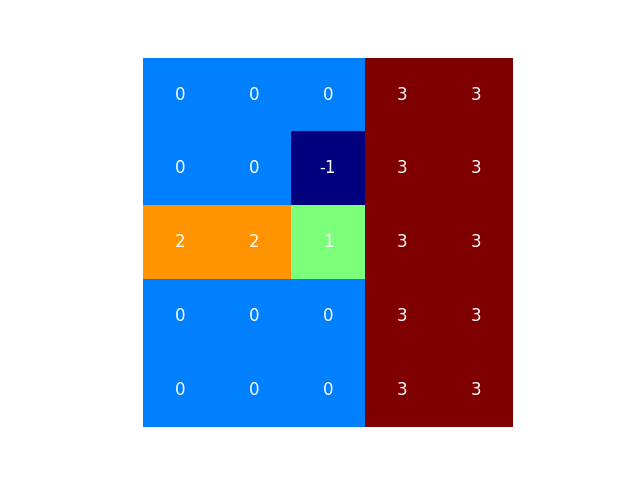

# snake ai

## running files

just cd to the directory you want. and run `python ./main.py` if you want to train a new agent.

else run `python ./testing.py` for testing pretrained agent

## info

the prefixes `growing` and `no_growing` at each of each directory is just meant to reduce the complexitiy of task. (if `no_growing` then when snake eates food it won't increase it's length)

in each directory:
- `agent.py`: well this is the agent.(a that player learns to play game). and the type of it is mentioned on the suffixes (e.g. `q_learning`)

- `helper.py`: the helper functions(e.g. for plotting the results)

- `main.py`: used to train the agent and save the weights(q values) on directories that start with `Q_values`

- `snake.py`: the game(enviroment). i've implemented it, and i tried to make it like gym enviroments

- `state_setting.py`: the function used to implement the inputs that the agent will receive from enviroment (that makes the game more flexible)

- `testing.py`: used to test the agent. which starts by loading the saved weights/q values and testing it.

## directories

### `no_growing_snake_q_learning`

after about less than 20_000 training steps the score passes from 1000

### `growing_snake_q_learning`

well as the chart suggests, the agent is unable to go further than 60-70 because of the lack of information

### `growing_snake_deep_q_learning`

the agent is able to learn. after about 80000 steps it reaches highscore of 50-60. but this is not perfect. probably the `hyperparameters` that i've choosed wasn't good enough. and there is `performance` problem which should be fixed. 

the file `state_setting.py` now returns a window of the snake head(25)* + direction of food(4) + direction of snake(4).

where:
- 0: is empty space
- -1: is the food
- 1: is snake head
- 2: is snake body
- 3: is walls
